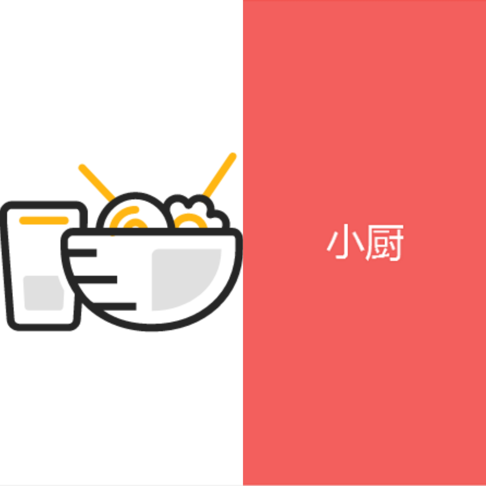

# Android实现卡片翻转的动画（翻牌动画）


## 需求描述

　　点击卡片，卡片翻转过来显示内容。



　　点击左边的卡片，将卡片翻转显示右边的图片结果。

## 功能实现

　　因为要翻转所以使用动画来完成翻转的动画。动画分为两部分，一部分是左边的布局以中心垂直线从左向右旋转，旋转 180 度之后隐藏，另一部分是右边的布局以中心垂直线从右向左旋转，旋转 180 度之后显示。

　　这种动画涉及到播放顺序的问题，所以动画使用 Animator 属性动画实现。

**布局**

```xml

    <FrameLayout

        android:id="@+id/activity_main_result_layout_fl"

        android:layout_width="@dimen/activity_main_result_width"

        android:layout_height="@dimen/activity_main_result_height"

        android:layout_gravity="center"

        android:layout_marginTop="@dimen/activity_main_result_margin_top">


        <ImageView

            android:id="@+id/activity_main_result_iv"

            android:layout_width="match_parent"

            android:layout_height="match_parent"

            android:src="@mipmap/result" />


        <TextView

            android:id="@+id/activity_main_result_tv"

            android:layout_width="match_parent"

            android:layout_height="match_parent"

            android:gravity="center"

            android:textColor="@android:color/white"

            android:textSize="@dimen/activity_main_text_size"

            android:visibility="gone" />


    </FrameLayout>

```

**动画文件**

* rotate_in_anim .xml

```xml

<?xml version="1.0" encoding="utf-8"?>

<set xmlns:android="http://schemas.android.com/apk/res/android">

    <!--消失-->

    <objectAnimator

        android:duration="0"

        android:propertyName="alpha"

        android:valueFrom="1.0"

        android:valueTo="0.0" />


    <!--旋转-->

    <objectAnimator

        android:duration="1000"

        android:propertyName="rotationY"

        android:valueFrom="-180"

        android:valueTo="0" />


    <!--出现-->

    <objectAnimator

        android:duration="0"

        android:propertyName="alpha"

        android:startOffset="500"

        android:valueFrom="0.0"

        android:valueTo="1.0" />

</set>

```

* rotate_out_anim.xml

```xml

<?xml version="1.0" encoding="utf-8"?>

<set xmlns:android="http://schemas.android.com/apk/res/android">

    <!--旋转-->

    <objectAnimator

        android:duration="1000"

        android:propertyName="rotationY"

        android:valueFrom="0"

        android:valueTo="180" />


    <!--消失-->

    <objectAnimator

        android:duration="0"

        android:propertyName="alpha"

        android:startOffset="500"

        android:valueFrom="1.0"

        android:valueTo="0.0" />

</set>

```


**播放动画**

```java

    tv_result.setVisibility(View.VISIBLE);

    tv_sure.setVisibility(View.VISIBLE);

    AnimatorSet inAnimator = (AnimatorSet) AnimatorInflater.loadAnimator(this, R.animator.rotate_in_anim);

    AnimatorSet outAnimator = (AnimatorSet) AnimatorInflater.loadAnimator(this, R.animator.rotate_out_anim);

    int distance = 16000;

    float scale = getResources().getDisplayMetrics().density * distance;

    iv_result.setCameraDistance(scale); //设置镜头距离

    tv_result.setCameraDistance(scale); //设置镜头距离

    outAnimator.setTarget(iv_result);

    inAnimator.setTarget(tv_result);

    outAnimator.start();

    inAnimator.start();

    outAnimator.addListener(new AnimatorListenerAdapter() {

    	@Override

        public void onAnimationEnd(Animator animation) {

        	super.onAnimationEnd(animation);

            iv_result.setVisibility(View.GONE);

            iv_result.setAlpha(1.0f);

            iv_result.setRotationY(0.0f);

        }

	});

```

　　**注意**：动画的实现方式是使用了属性动画 Animator 实现的，如果动画需要再次显示，那么在动画结束之后就需要将控件的属性值设置为初始值，因为属性动画会修改控件的属性值为动画结束时的属性值。


## 参考文章

http://lishuaishuai.iteye.com/blog/2297056